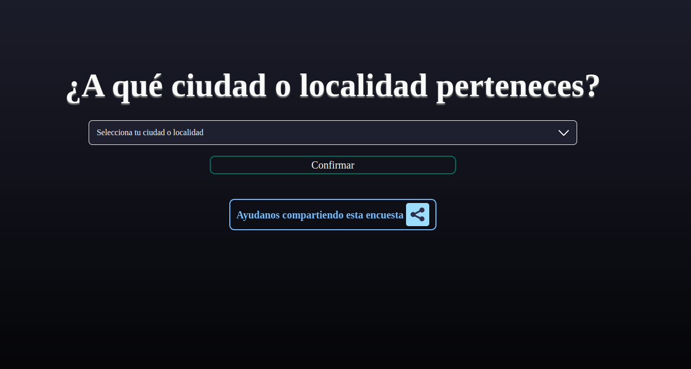
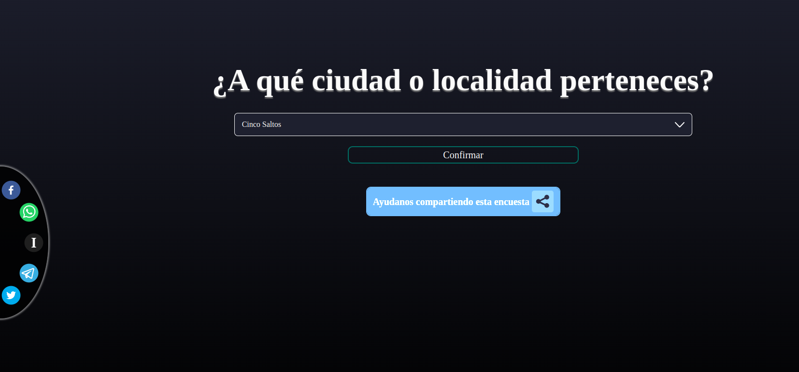
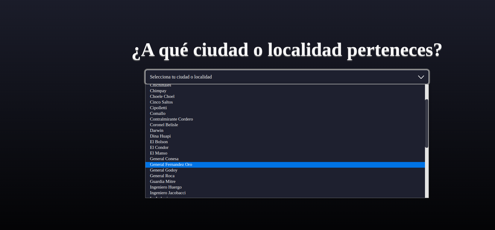
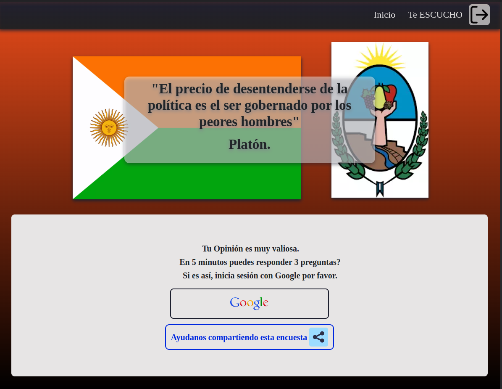

# Elections questions pages - 2023

### Página web responsive para recopilar datos brindados por usuarios en base a las elecciones en Río Negro 2023.

## `Cliente: React, Styled components`

## `Servidor: Firebase`

 

 

 

 

## Puedes verla en: https://2023-elections-questions-page.vercel.app/#/generalFernandezOro

#### NOTA: los permisos asi como las credenciales de ` Google Firebase Auth` pueden haber expirado
