# Virtual Orders

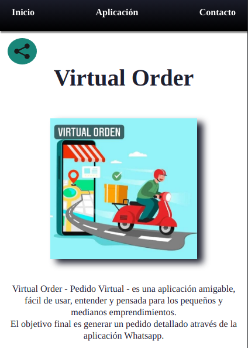

## Aplicación pensada para todas aquellas tiendas que deseen ofrecer sus productos en un sólo lugar.

### Así como recibir, por whatsapp, una orden detallada con los productos que el cliente seleccionó para poder coordinar el pago y entrega de los mismos. Nosotros no gestionamos tu dinero.

## Requerimientos

    ● En pantalla Home se deberá mostrar todas las comidas la tienda dispone para los cliente, discriminada por categorías-

    ● No hay necesidad de estar logeado.

    ● El sistemas debe permitir al usuario realizar una búsqueda filtrando por categoría o nombre de la comida.

    ● El sistema debe permitir al usuario poder agragar a un carrito la comida y cantidad de la misma seleccionada.

    ● El sistema mostrará al usuario el carrito con las comidas seleccionadas, el monto total, y las opciones para poder eliminar una comida del carrito.

    ● El sistema deberá mostrar un formulario para confirmar la compra del usuario. El mismo deberá permitir agregar
        `apellido y nombre`
        `Forma de pago`:
            `Efectivo o Billetera Virtual (Mercado pago, uala, brubank, etc)`
        `Tipo de entrega`
             `Buscar en local o Enviar a domicilio`
        `Detalle Adicional`

    ● El sisema esperará que el usuario confirme un CAPTCHA.
    ● El sistema deberá generar un pedido a través de Whatsapp. El mismo llegará al número de telefóno asociado a la tienda.

#### ACTUALIZADO:

##### Agregada opción para compartir en redes sociales

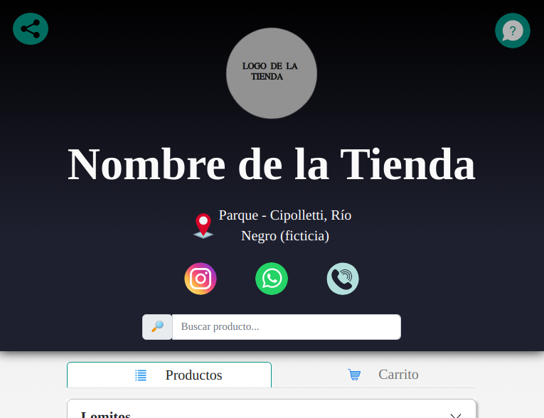

 

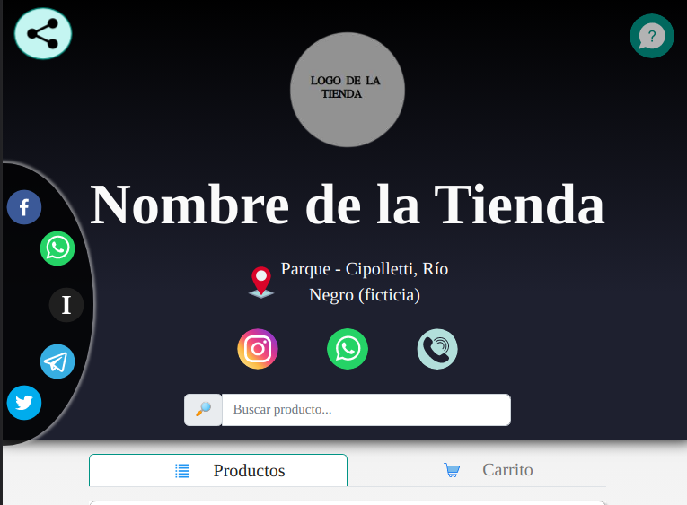

### VERSIÓN 1:

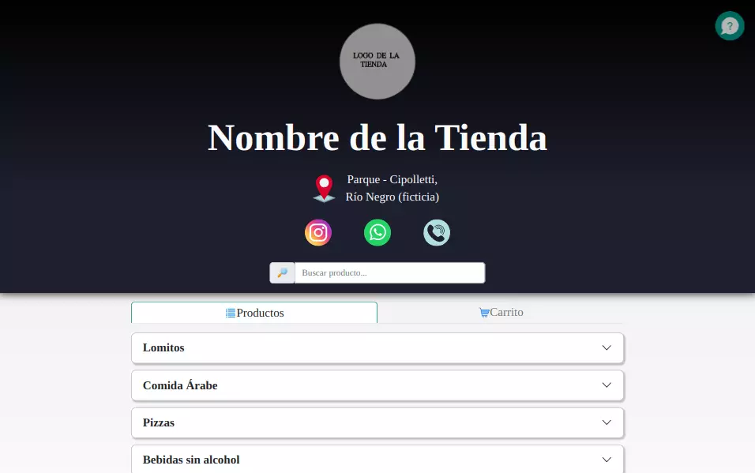

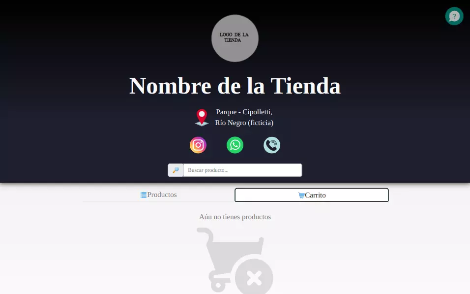

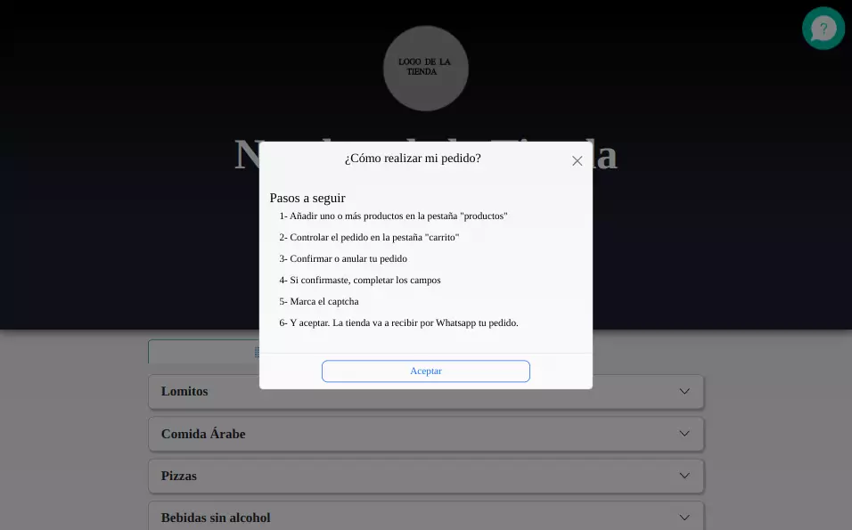
 

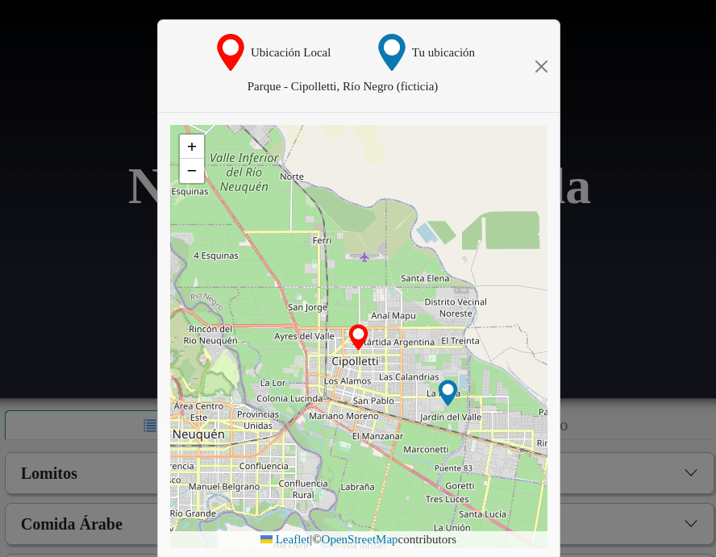

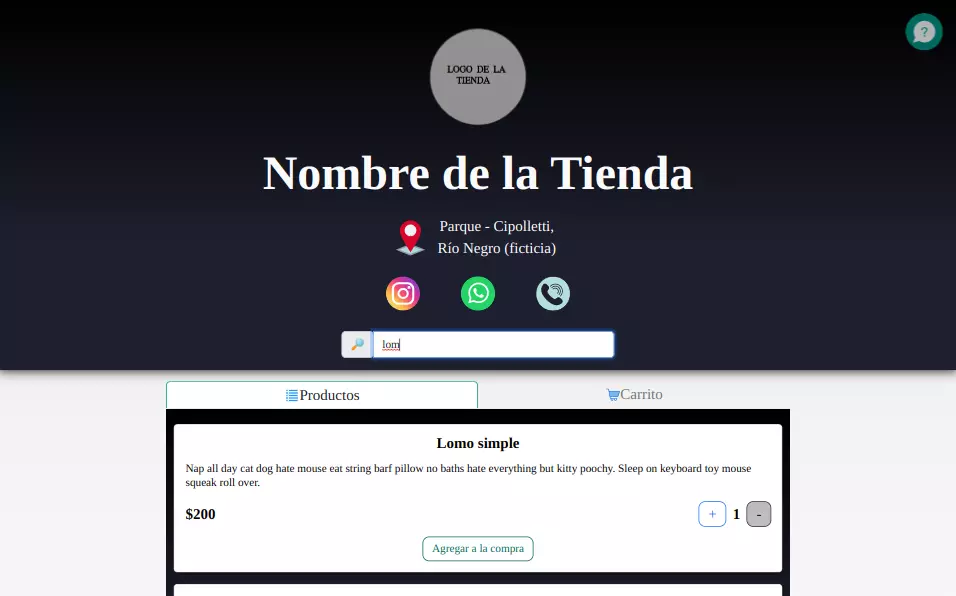
 

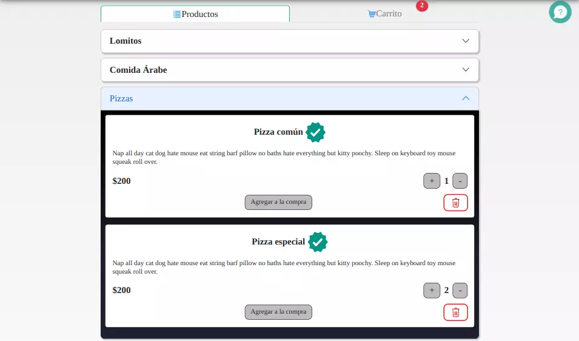
 

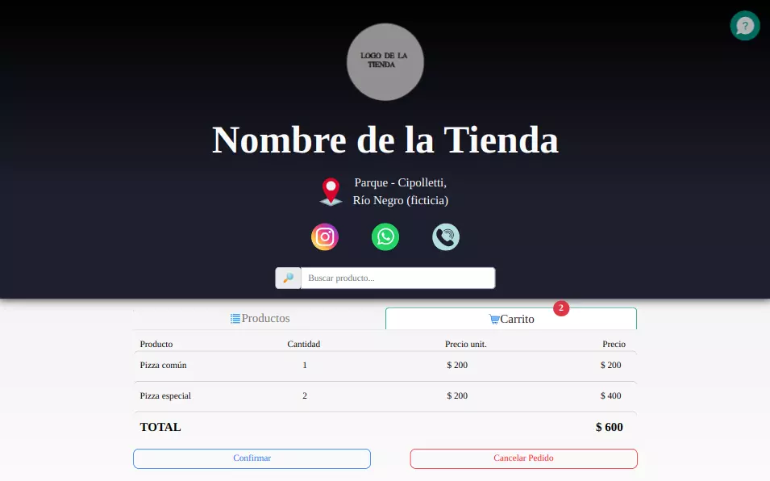
 

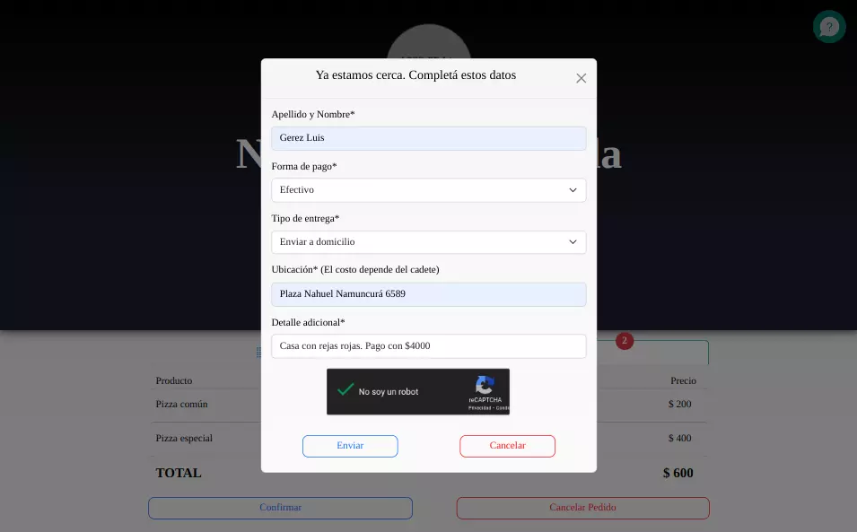
 

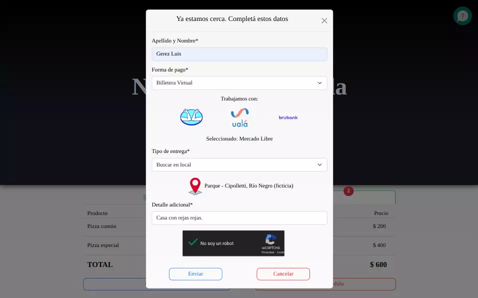

 

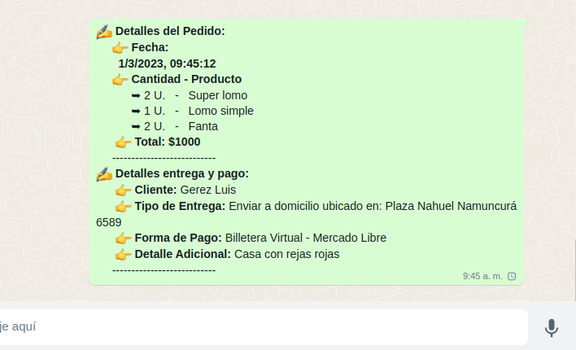

 

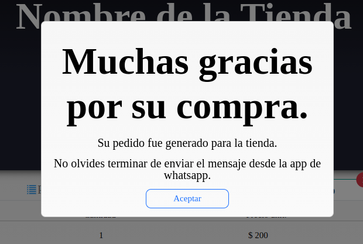

## Puedes verla en: https://virtualorder.vercel.app/example-store
