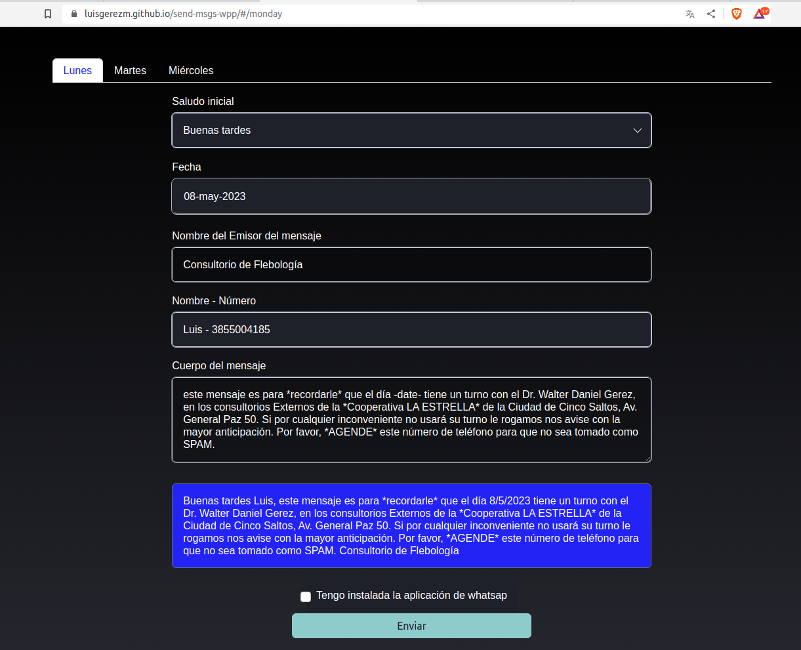
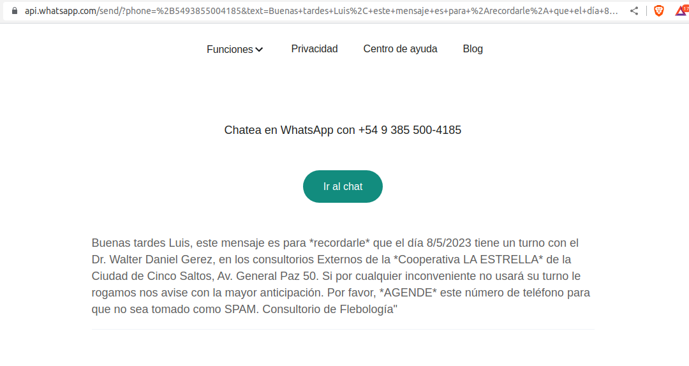
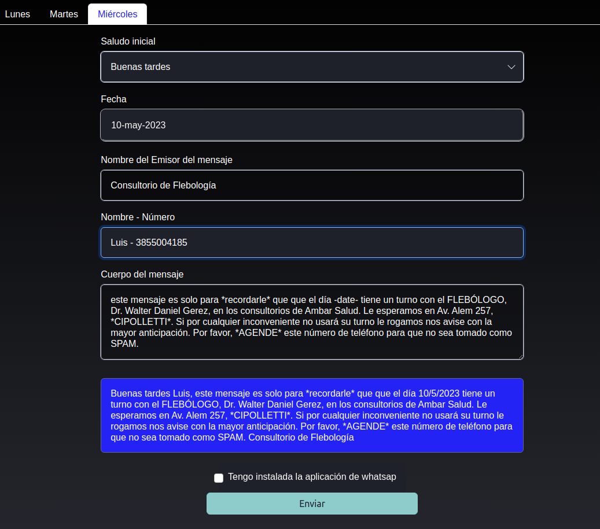
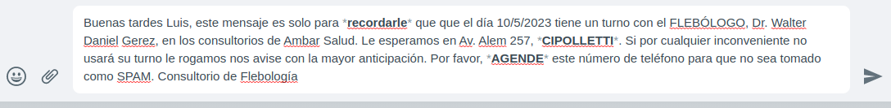

## Proyecto send-msg-wpp

#### Version 2.0

##### Se modificó la interfaz, siendo mucho más sencilla de usar, asi como también se le agregó un día más.

##### Se refactorizó el código para que sea más eficiente y mantenible.

##### Se añadió una función para el calculo automático de la fecha, en base al dia actual, considerando si el día seleccionado ya pasó o aún no llega. Las capturas fueron realizadas un Miércoles 03-may-2023

---

### Este proyecto surge para atender una necesidad observada.

### Una mañana, mientras desayunabamos, mi papá se demoró porque tenía que enviar mensajes privados a cada uno de sus pacientes a través de whatsapp web, por lo que decidí realizar este pequeño proyecto para brindarle una herramienta que le sirva de ayuda.

---

 

### Deploy: https://luisgerezm.github.io/send-msgs-wpp/#/monday

 

 

 

 

